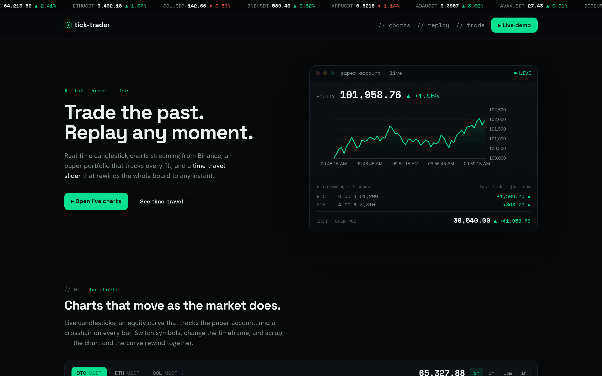
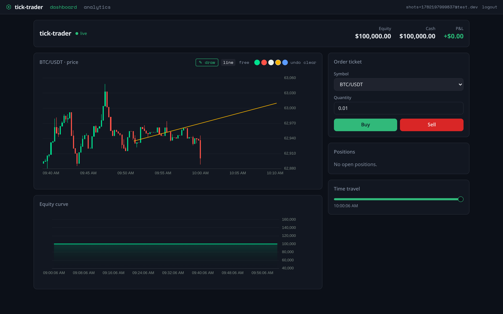
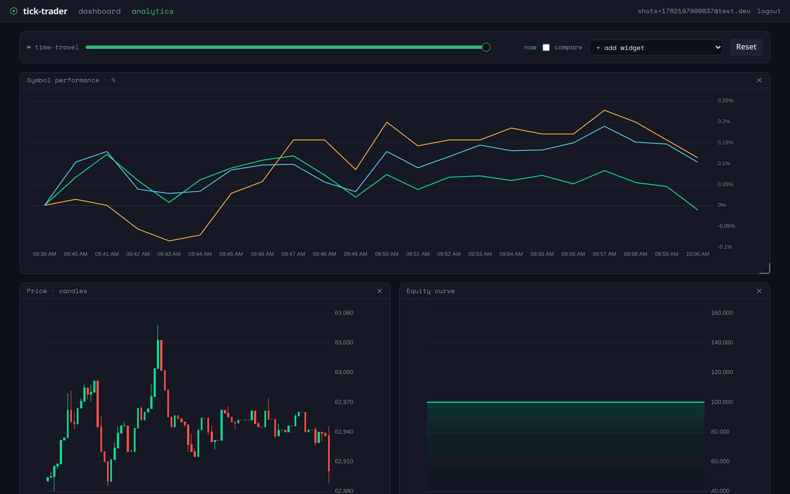
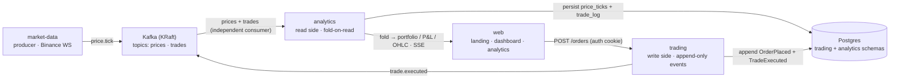

# TickTrader

> An **event-sourced paper-trading platform**. No mutable balance is ever stored — cash,
> positions and P&L are always *folded from an append-only event log*, so a **time-travel**
> slider rebuilds the exact portfolio at any past instant and any read model replays from zero.
>
> Real-time microservices over Kafka. Fastify + TypeBox + Kysely + KafkaJS · Vite + React + ECharts.




## What it does

Sign up, get an isolated paper account starting at $100,000, and trade three symbols (BTC, ETH,
SOL) against **live Binance prices streamed over Kafka**. Every order appends events to an
**append-only log**; your cash, positions and P&L are never stored as columns — they're
recomputed by *folding* the log on every read. Because state is a pure function of the log, one
**time-travel** slider reconstructs the entire portfolio — and every analytics widget — at any
past instant.

> **State is a fold, not a row.** Rewind the whole board to any moment; replay rebuilds it.

| Trading dashboard | Analytics board |
| --- | --- |
|  |  |

On the dashboard you can **draw prediction lines** — straight or freehand — directly on the
price chart. They're anchored to timestamps, so they project *past the latest candle into the
future* and stay pinned to the data as it streams in.

## Why it's interesting (engineering signals)

- **Event sourcing, not a balance column** — `cash`, `positions`, `avgCost`, `realized` and
  `unrealized` P&L are pure folds over the trade log. Time-travel is the *same* fold with a
  different upper bound (`GET /portfolio?at=<T>`), and read models rebuild by replay — no
  projection tables to drift.
- **CQRS fan-out over Kafka** — the `analytics` read side consumes the same `prices` / `trades`
  topics with **zero changes** to the producer or write side. Adding a projection means adding a
  consumer, nothing else.
- **Per-tenant isolation** — email/password with an httpOnly JWT cookie verified by *both*
  services (shared secret); every event, fold and SSE stream is scoped by `account_id`, enforced
  in the queries.
- **Real-time end to end** — Binance WS → Kafka → SSE to the browser. Store notifications are
  coalesced to one repaint per animation frame, so a chatty feed never freezes the UI.
- **Prediction lines on a continuous time axis** — drawn shapes are `[timestamp, price]`
  polylines re-projected through an ECharts custom series, so they survive zoom/pan/stream and
  can extend into a future region revealed when the pen is active.
- **Typed end to end** — strict TypeScript (`noUncheckedIndexedAccess`, `exactOptionalPropertyTypes`,
  no `any`), unit-tested folds + order validation (`node:test`), Biome + Husky, GitHub Actions CI
  on every PR, ≤150 lines per file.

## Golden path

1. `docker compose up --build` → open the web app.
2. Create an account at `/signup`.
3. Place a paper buy/sell on the dashboard → it appends `OrderPlaced` + `TradeExecuted`; the
   portfolio folds live.
4. Draw a prediction line (or freehand stroke) into the future on the price chart.
5. Scrub the **time-travel** slider → the whole portfolio reconstructs at that past instant.
6. Open the **analytics board** — drag/resize/add widgets, and turn on *compare* to diff two moments.

## Architecture

CQRS + event sourcing over Kafka: a producer, a write side, and a read side that communicate
**only through events**.



- **`market-data`** — producer. A `MarketFeed` adapter (`BinanceFeed` real WS by default, no API
  key; `SimulatedFeed` random-walk fallback, env-selected) publishes ticks to `prices`. Stateless.
- **`trading`** — write side. `POST /orders` validates against the last tick, appends
  `OrderPlaced` → `TradeExecuted` to its append-only event store (scoped by `account_id`), and
  publishes `TradeExecuted` to `trades`. Issues the auth cookie; owns the system of record.
- **`analytics`** — read side. Independent consumer of `prices` + `trades`; persists price history
  and a trade log, then serves every read (portfolio, temporal, metrics, OHLC, events) by
  **folding on read**, plus the per-account SSE stream. Verifies the same auth cookie.
- **`apps/web`** — Vite + React SPA: marketing landing, trading dashboard, configurable analytics board.

### The event-sourcing payoff

All state is a pure function of the logs; nothing mutable is persisted:

- `cash(T)` = `STARTING_CASH − Σ buys + Σ sells` over trades ≤ T
- `positions(T)` = net qty + average cost per symbol over trades ≤ T
- `equity(T)` = `cash(T) + Σ qty × priceAsOf(symbol, T)`

`priceAsOf` makes historical valuation correct: the time-travel slider values the *historical*
portfolio at *historical* prices. `GET /portfolio?at=<T>` is the same fold with a different upper
bound — no special-casing.

## Quickstart

```bash
cp .env.example .env          # set a real JWT_SECRET (shared by trading + analytics)
docker compose up --build     # kafka + postgres + the 3 services + web
# ports taken? →  WEB_PORT=3010 POSTGRES_PORT=5434 docker compose up --build

# open http://localhost:3000   ·   Swagger at /api/v1/docs
```

Then create an account at `/signup` and start trading. Market data uses the keyless Binance
public WS by default; set `MARKET_FEED=simulated` for a deterministic offline feed. `JWT_SECRET`
must match across `trading` and `analytics` (compose ships a dev default — override it).

### Run locally without Docker

```bash
pnpm install
docker compose up -d kafka postgres          # infra only
pnpm --filter @tick-trader/market-data dev    # + trading, analytics, web in their own shells
pnpm --filter @tick-trader/web dev            # Vite on :5173
```

## Tech specification

| Component | Technology | Details |
| --- | --- | --- |
| Services | **Fastify 5** (3 services) | producer / write side / read side, coupled only by events |
| Messaging | **Kafka (KRaft)** + **KafkaJS** | single broker; `prices` + `trades` topics |
| Schemas | **TypeBox** + `@fastify/type-provider-typebox` | one definition → runtime validation, static types, Swagger |
| DB access | **Kysely** + `pg` | typed SQL; append-only event store + read tables |
| Database | **PostgreSQL 16** | one instance, `trading` + `analytics` schemas |
| Auth | **@fastify/jwt** + **@fastify/cookie** + `bcryptjs` | httpOnly cookie `tt_token`; events/folds/SSE scoped by `account_id` |
| Realtime | **SSE** (one-way, auto-reconnect) | live `price` / `trade` to the browser, per account |
| Web | **Vite 6 + React 19** | landing + dashboard + analytics board |
| Charts | **Apache ECharts 6** | candlesticks, equity/P&L, allocation, normalized compare, drawing overlay |
| Grid | **react-grid-layout 2** (`/legacy`) | configurable 4-col board: drag / resize / persist |
| State | **Jotai 2** | atoms + `atomWithStorage`; an rAF-coalesced store feeds live ticks |
| Styling | **Tailwind 3** + shadcn-style | dark "Phosphor" theme; Space Grotesk / Hanken Grotesk / Space Mono |
| Routing | **react-router 7** | `/` landing · `/login` · `/signup` · `/app` · `/app/analytics` |
| Language | **TypeScript** (strict) | `noUncheckedIndexedAccess`, `exactOptionalPropertyTypes`, no `any` |
| Tooling | **pnpm** workspaces · **Biome** · **Husky** · **GitHub Actions** | type-check → lint → test on every PR; Node ≥ 22 |

## Project layout

```
packages/contracts/   TypeBox events, topic names, constants, pure fold helpers (shared)
services/market-data/ tick producer (Binance / simulated)
services/trading/     write side: auth, orders, append-only event store, prices consumer
services/analytics/   read side: consumers, fold-on-read queries, per-account SSE
apps/web/             Vite + React: landing, dashboard, configurable analytics board
```

## Design notes

- **Fold-on-read, no projection tables.** Every read recomputes from the log, so projections
  can't drift; replay cost is bounded by log length (see *Deferred* for snapshots).
- **Market orders fill at the last tick.** No order book or matching engine — the focus is the
  event/CQRS architecture, not exchange mechanics.
- **One JWT secret shared by both services.** Stateless verification on each side, no session
  store; rotation/revocation are deferred.
- **Drawings are a client-side annotation.** Prediction lines persist per account+symbol in
  localStorage, not as events — they're a UI overlay, not part of the system of record.

### Deferred (post-MVP)

- Snapshots + materialized projections to bound replay cost; partitioned topics + DB-per-service;
  `market-data` reconnect/backfill + dead-letter for gaps; JWT rotation/revocation; an order book
  with limit orders.

## License

MIT
